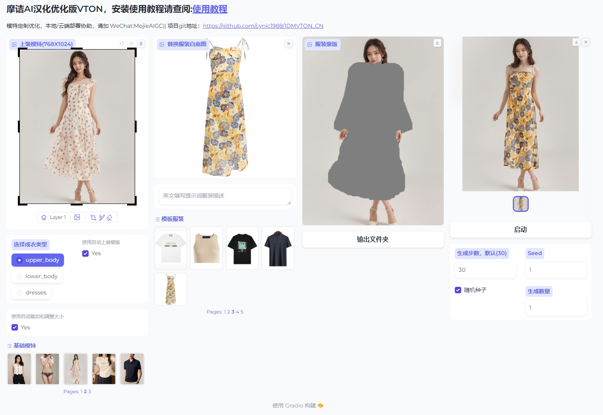

<div align="center">
<h1>IDM-VTON: Improving Diffusion Models for Authentic Virtual Try-on in the Wild</h1>

<a href='https://idm-vton.github.io'></a>
<a href='https://arxiv.org/abs/2403.05139'></a>
<a href='https://huggingface.co/spaces/yisol/IDM-VTON'></a>
<a href='https://huggingface.co/yisol/IDM-VTON'></a>

</div>
## 上面是项目原信息地址

<h1 align="center">摩诘AI-VTON优化汉化版-FastAPI</h1>

[摩诘AI-VTON优化汉化版](https://github.com/MoJIeAIGC/IDMVTON_CN.git)

Star ⭐ us if you like it!

---
### 本版本对原项目idm-VTON界面做了汉化，优化了原有的内置模特和服装，用SD重做了新模特，增加了一键安装功能和一键运行功能,category成衣类型选项，随机种子和生成数量可选。
### VTON可以对服装细节做很好的还原保留，对比目前其他同类模型OOTD等，对人物姿势动作识别以及服装还原效果更好。不过在使用上会有很多技巧，详情可以参考教程。

&nbsp;
&nbsp;
&nbsp;

## 如何运行
安装好所有依赖后，运行
```
IDM-VTON/main.py
```
And Enjoy~


## 演示地址

汉化版没有部署云端演示地址。
可查看原版huggingface上的演示地址 [demo](https://huggingface.co/spaces/yisol/IDM-VTON)

---

## Acknowledgements

Thanks [ZeroGPU](https://huggingface.co/zero-gpu-explorers) for providing free GPU.

Thanks [IP-Adapter](https://github.com/tencent-ailab/IP-Adapter) for base codes.

Thanks [OOTDiffusion](https://github.com/levihsu/OOTDiffusion) and [DCI-VTON](https://github.com/bcmi/DCI-VTON-Virtual-Try-On) for masking generation.

Thanks [SCHP](https://github.com/GoGoDuck912/Self-Correction-Human-Parsing) for human segmentation.

Thanks [Densepose](https://github.com/facebookresearch/DensePose) for human densepose.

Thanks [FurkanGozukara](https://github.com/FurkanGozukara/IDM-VTON) for Install the package.


## Citation
```
@article{choi2024improving,
  title={Improving Diffusion Models for Virtual Try-on},
  author={Choi, Yisol and Kwak, Sangkyung and Lee, Kyungmin and Choi, Hyungwon and Shin, Jinwoo},
  journal={arXiv preprint arXiv:2403.05139},
  year={2024}
}
```


## License
The codes and checkpoints in this repository are under the [CC BY-NC-SA 4.0 license](https://creativecommons.org/licenses/by-nc-sa/4.0/legalcode).


